:ribbon: Gatsby :heavy_plus_sign: Contentul :heavy_plus_sign: Netlify = :heart: :ribbon:
:tophat: + Stripe + Auth0 :tophat:

This is my first Gatsby + Contentul + Netlify tutorial built from scratch.
I also added a shop with Sprite and 2 authentication system: one hard-coded, one with auth0.

[Deploy preview](https://gbouffard-my-gatsby-contentul-tutorial.netlify.com/)
No deploy should be made to that repo anymore. The Contentful Space has been deleted and I have stopped the Netlify auto-deploy.

I used these tutorials:

- [Gatsbyjs tutorials](https://www.gatsbyjs.org/tutorial/)
- [Content management with Gatsby, Netlify and Contentful](https://dev.to/thebabscraig/content-management-with-gatsby-netlify-and-contentful-3kbg)
- [Gatsby advanced blog tutorial](https://reactgo.com/gatsby-advanced-blog-tutorial)
- [Using Gatsby with css modules and scss](https://medium.com/@PostgradExpat/using-gatsby-with-css-modules-and-scss-7e75a05533a4)
- [Gatsby E-Commerce Tutorial](https://www.gatsbyjs.org/tutorial/ecommerce-tutorial/)
- [Securing Gatsby with Auth0](https://auth0.com/blog/securing-gatsby-with-auth0/)
- [Gatbsy mistakes](https://jenniferwadella.com/blog/all-the-dumb-mistakes-i-made-building-my-first-gatsby-site)

## How to run it locally:

(should not work anymore because Contentful data has been deleted)

```
git clone git@github.com:GBouffard/my-gatsby-contentul-tutorial.git
cd my-gatsby-contentul-tutorial
yarn
gatsby develop
```

nb: in theory, you'd need to add your own YOUR_SPACE_ID & YOUR_CONTENT_DELIVERY_API_KEY in .env.
To use Stripe your the GATSBY_STRIPE_PUBLISHABLE_KEY and GATSBY_STRIPE_SECRET_KEY also need to be in the environment.

You can now navigate to `http://localhost:8000`

## How to log in onto the hard-coded system (Not using Auth0):

```
username: GB
password: password
```

## How to log in onto Auth0 system:

Simply with an email and password

## How to simulate payment in Stripe:

The following fake cards are available and the shop used is still the test shop:

```
4242 4242 4242 4242        // visa
5555 5555 5555 4444        // Mastercard
```

## Using The GraphiQL playground:

the GraphiQL playground can be used at `http://localhost:8000/___graphql`

Example of query:

```
{
  allContentfulBlogPost {
    edges {
      node {
        id
    slug
        title
        tags
        image {
          file {
            url
          }
        }
      }
    }
  }
}
```

## Screenshots:

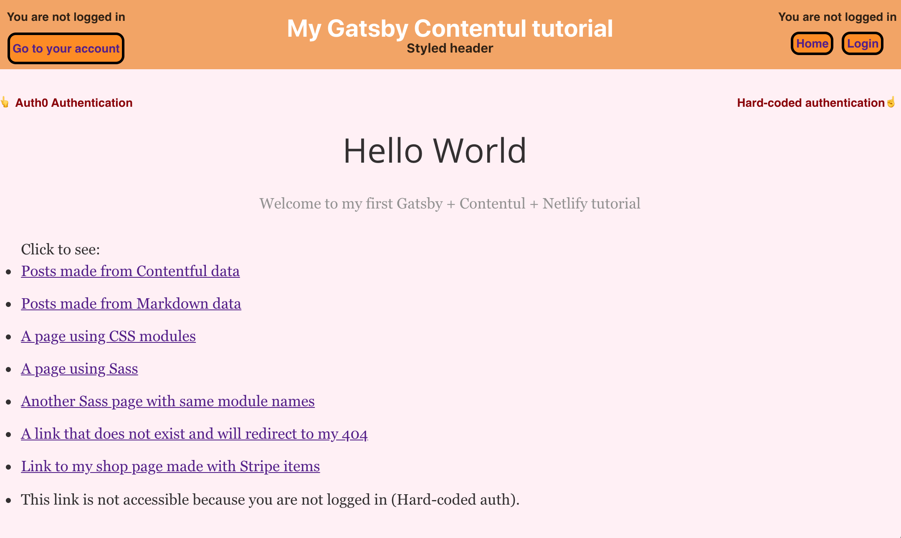

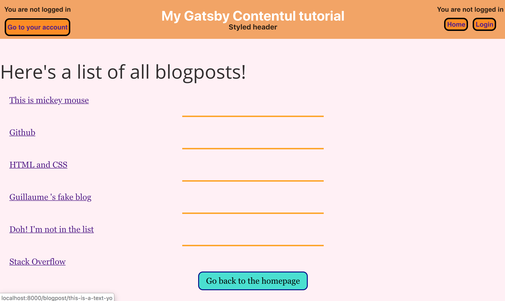

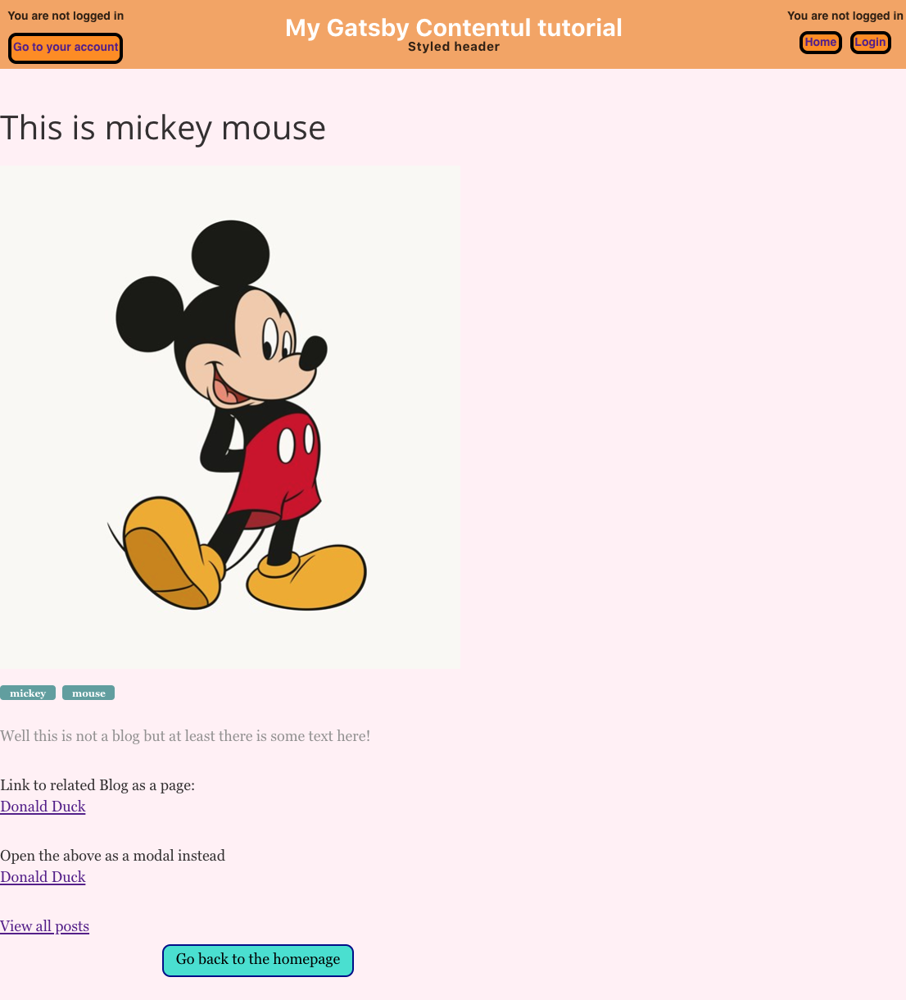

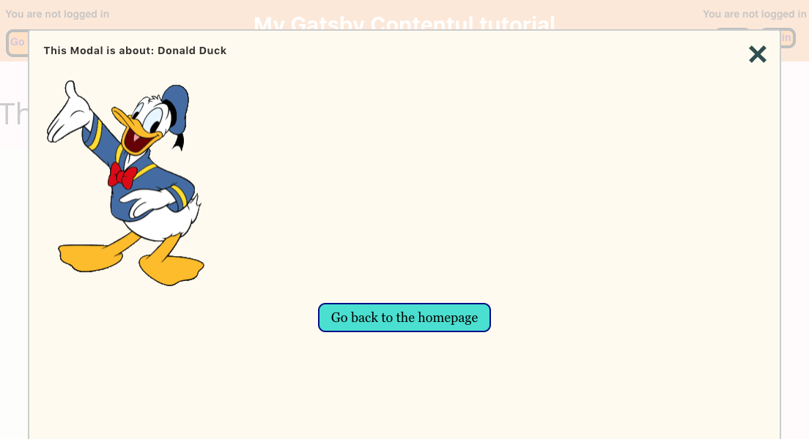

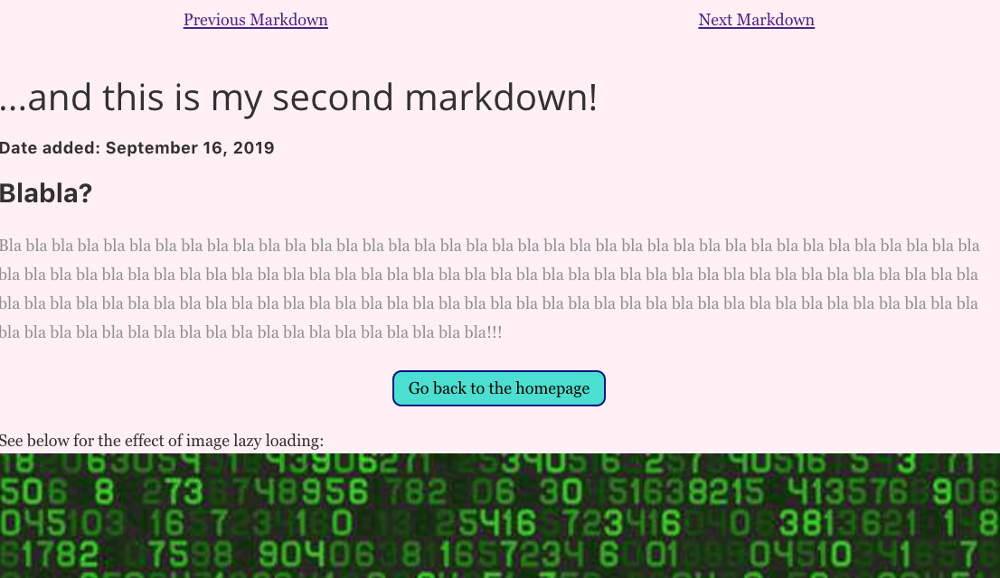

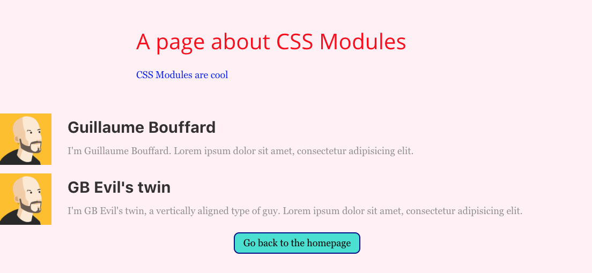

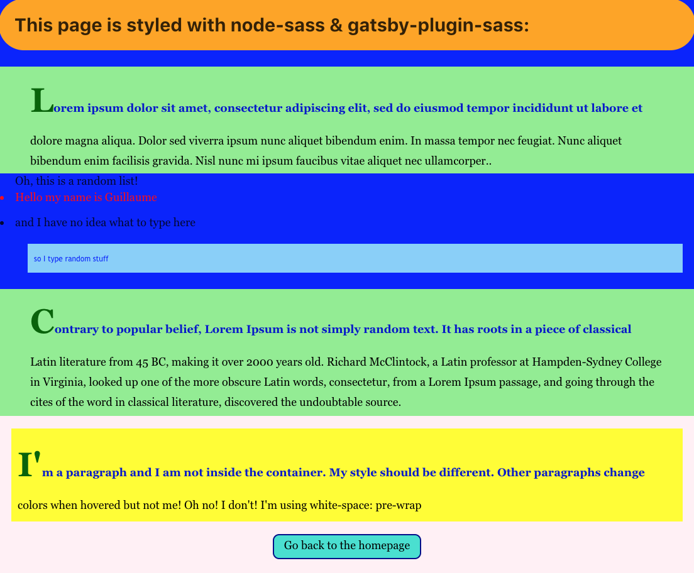

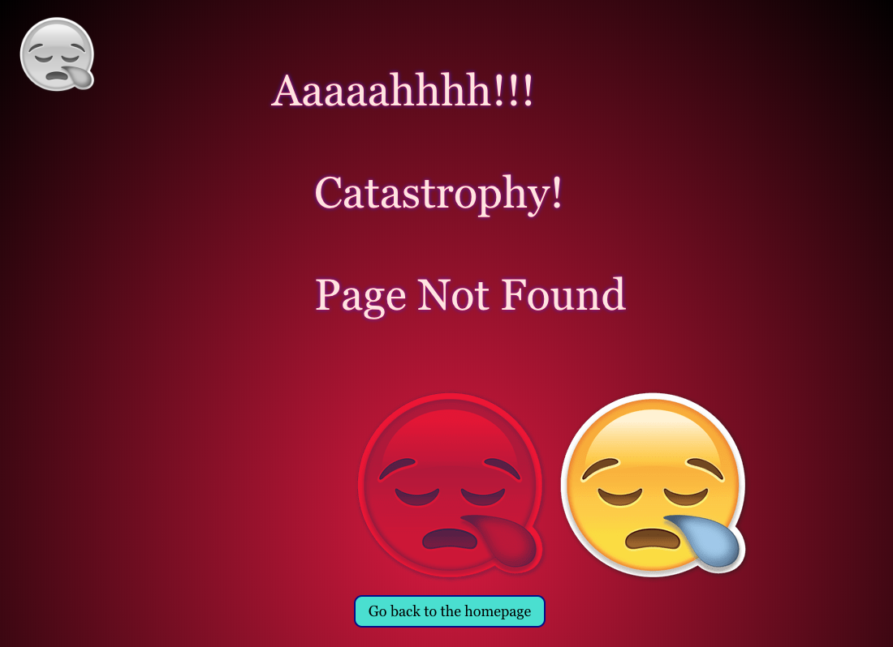

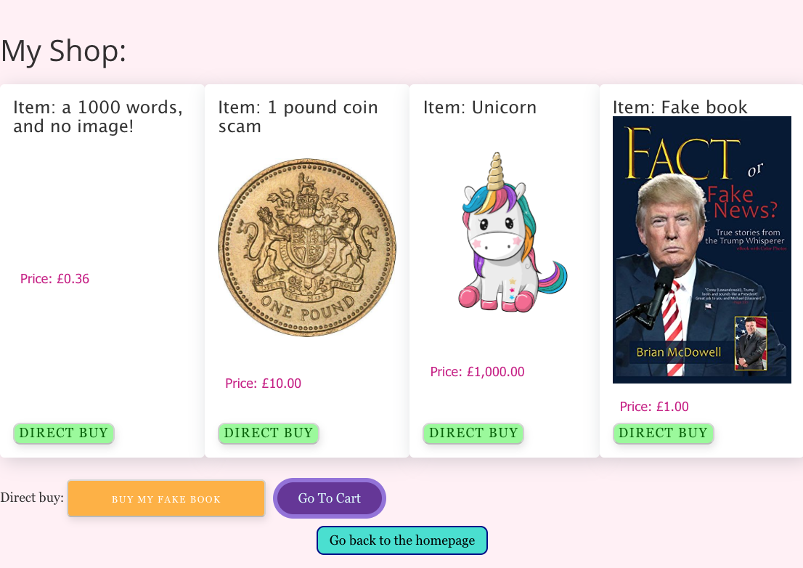

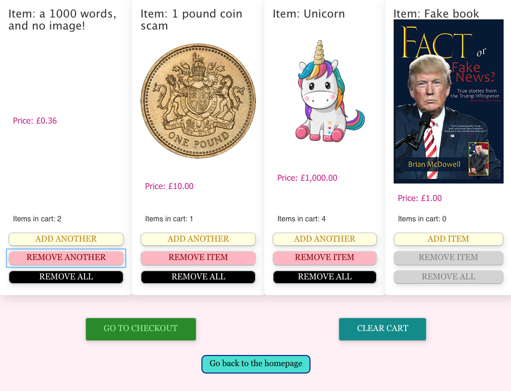

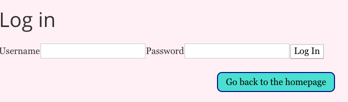

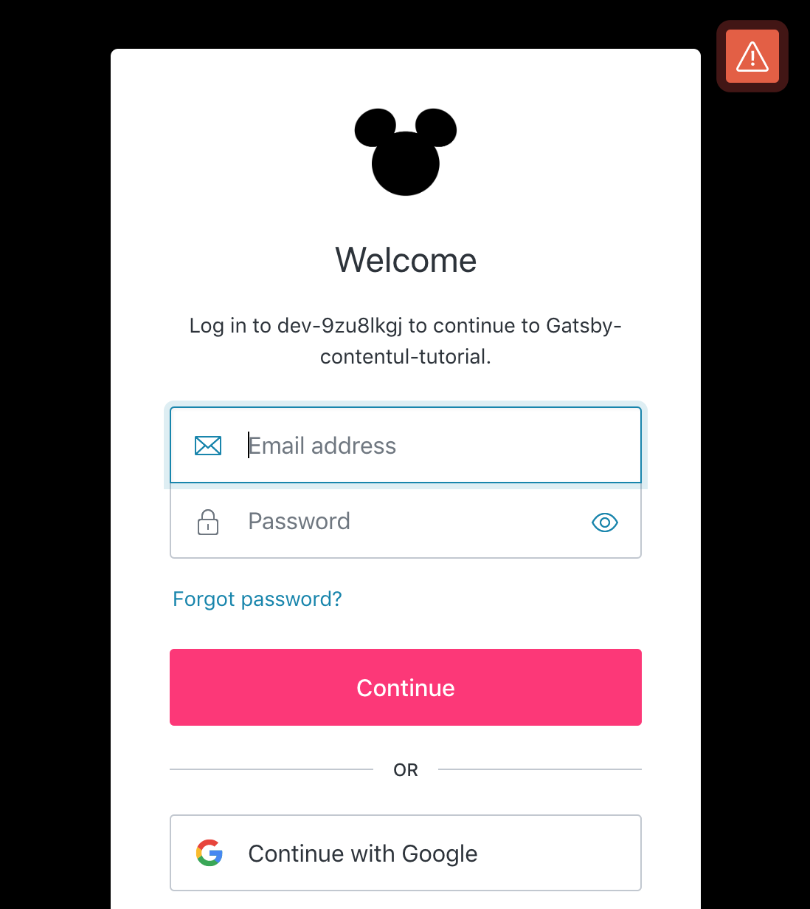

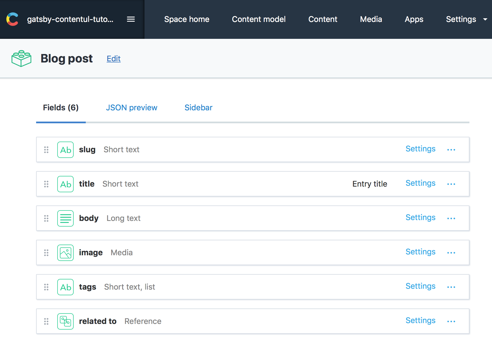

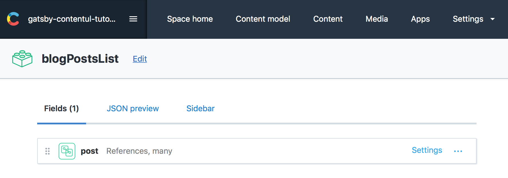


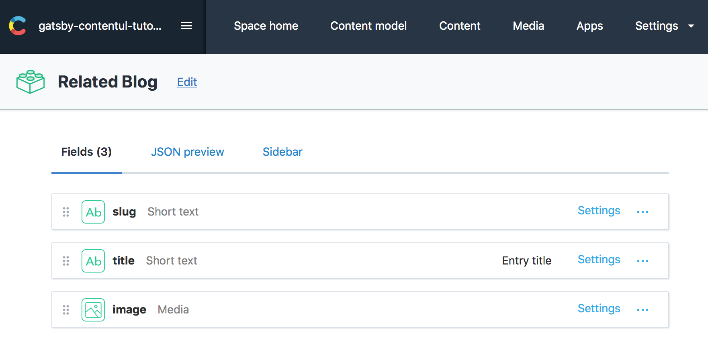


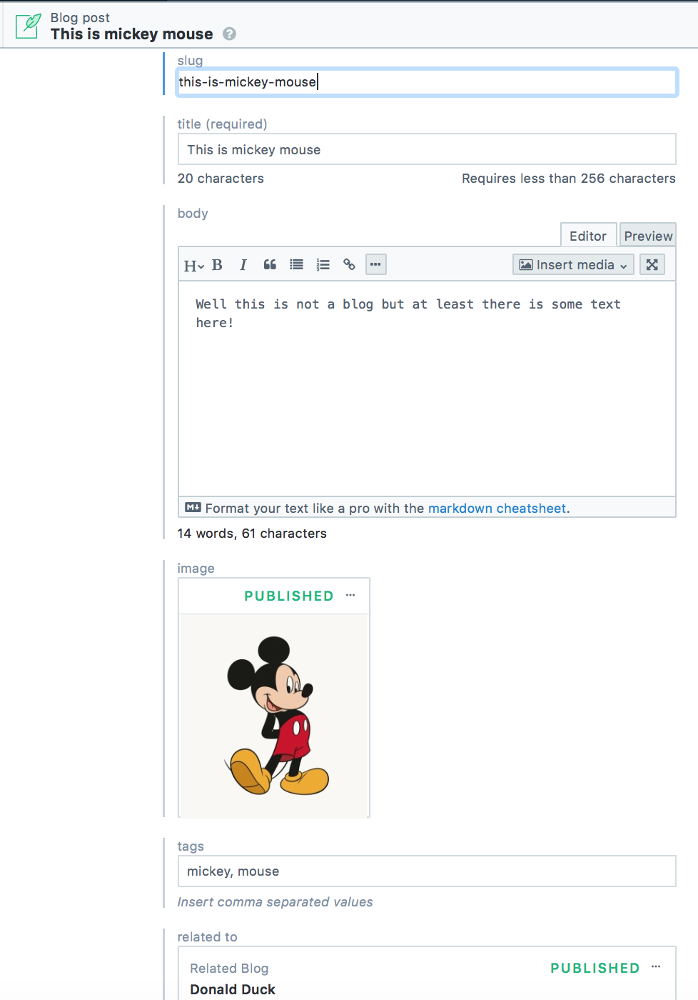
